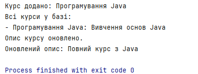
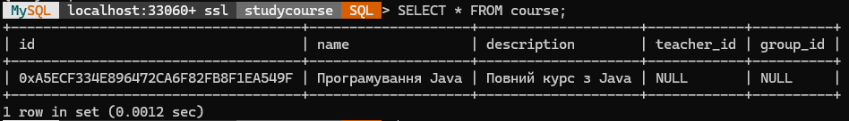

# Система управління учбовим процесом — Проєкт на Java з DAO

---

## Опис проєкту

Цей проєкт демонструє базову реалізацію системи управління учбовим процесом на Java з використанням бази даних MySQL і патерну DAO (Data Access Object).

Основна функціональність — робота з курсами (таблиця `course`), яка включає операції:

- Створення курсу
- Отримання курсу за ID
- Отримання списку всіх курсів
- Оновлення курсу
- Видалення курсу

## Інструкція запуску

1. Створити базу даних `course` у MySQL і таблицю `course` згідно SQL вище.
2. Вказати у `DatabaseConnection.java` правильні дані для підключення (URL, користувач, пароль).
3. Підключити MySQL JDBC драйвер (наприклад, через Maven `mysql-connector-java`).
4. Зібрати і запустити програму — вона додасть курс, виведе всі, оновить опис, перевірить оновлення.

---

## Завантаження результатів

## Висновок

У цьому проєкті було реалізовано базову систему керування учбовим процесом з використанням Java і MySQL. Патерн DAO дозволяє відокремити логіку доступу до бази даних від бізнес-логіки, що підвищує підтримуваність і масштабованість коду.

Використання UUID у форматі `BINARY(16)` оптимізує збереження і пошук даних. CRUD операції забезпечують повний набір дій з керування курсами.

